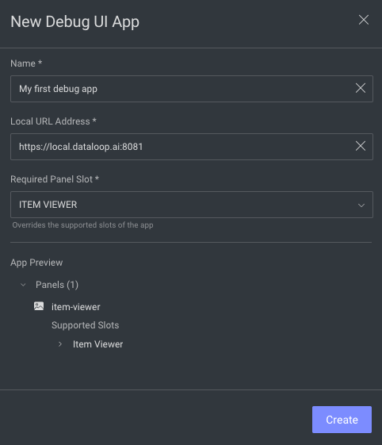

# Debug Applications (Development stage)

Debug apps are applications used in the Platform, that are still in their initial stages of development.
They allow developers to identify and resolve bugs, errors, and other technical issues that may arise during the development process.
By using debug apps, developers can ensure that their applications are functioning as expected and provide a smooth and seamless user experience.

*- Used for applications that have panels (UI)*.

### Basic requirements
* For working on dev/local environment, you will need to add `local.dataloop.ai` to your hosts file.
  * Open your hosts file with admin/sudo privileges. This is normally in `/etc/hosts` on Linux, `C:\Windows\System32\drivers\etc\hosts` on Windows. Add this line to the end of the file: `127.0.0.1 local.dataloop.ai`
  * You might also need to run your app in *https* mode.
* You may need to enable [CORS](https://developer.mozilla.org/en-US/docs/Web/HTTP/CORS) on your app.
* Your app should be up running in the browser.
* Your app should have a  `dataloop.json` file that stimulates an installed app entity - it needs to be publicly served under the app's main address (For example: https://local.dataloop.ai:3000/dataloop.json).
* You're going to need a working, functioning Dataloop Platform user with a **Developer** role.
* You're going to need to be familiar with our [Javascript SDK](../../index.md)

### How to add a debug app in the Dataloop Platform
* On the left sidebar menu, go to **Application Hub** under the **Application (FAAS)** section, and open the **Developer** tab.

* Click the **Add Function** button.
* Fill out the name of the app, choose a main slot and add your application's URL address
  * (For example: https://local.dataloop.ai:3000)
  
* Press the **Create** button, and wallah! You have a debug app in the Platform.

* Go to the dataset browser, right-click on an item, *Open With...* and choose your app! <br /><p><br /></p>

### Tests

In order to run tests locally, you must mock the `dl` xFrame Driver and provide it with mock data. We created
a `DlMockDriver` and a **Debug Snapshot** shortcut exactly for that!

- The `DlMockDriver` is a mock driver that simulates the `dl` xFrame Driver, and is used for testing applications
  locally.
    - You can mock the `window.dl` during testing by assigning a new instance of `DlMockDriver` to `global.window.dl`,
      effectively overriding its original value.

* In order to get the mock data for the mock driver, you can use the **Debug Snapshot** feature.
    - [Add a debug app to the Platform](index.md#How to add a debug app in the Dataloop Platform).
    - Press the **Debug Snapshot** icon at the top bar (or **Alt+Shift+S**) in order to download the generated
      snapshot file.
    - Place the file in your tests directory.
    - Require the snapshot file in your test file, and use it to create a new instance of `DlMockDriver`.

```typescript
import { DlMockDriver } from '@dataloop/jssdk'

const data = require('./snapshot.json')
global.window.dl = new DlMockDriver(data)
```

_____


### Item Viewer Example
Here is an example of a basic Item Viewer App written in html & javascript
*(We trust that you're better than us and can write better code than this using something like React/Vue etc.)*

*This following item viewer example supports images only.*

`index.html`
```html
<!DOCTYPE html>
<html lang="en">

<head>
    <meta charset="UTF-8">
    <meta http-equiv="X-UA-Compatible" content="IE=edge">
    <meta name="viewport" content="width=device-width, initial-scale=1.0">
    <title>Dataloop item viewer</title>
</head>

<body>
<button onclick="handleClick()">refresh</button>
<button onclick="handleFetch()">Fetch Item</button>
<button onclick="handleAnnotations()">Fetch Annotations</button>
<br />
<input id="classification" type="text"/>
<button onclick="handleCreate()">Create Classification</button>
<div id="viewer-main">
    <div id="tools-container"></div>
    <div id="item-container"></div>
    <div id="annotations-container"></div>
</div>
</button>

<script src="https://console.dataloop.ai/dlAppLib.js"></script>
<script>
    const annotationsDiv = document.getElementById('annotations-container')
    let item = null

    const handleClick = async () => {
        window.location.reload()
    }

    const maskIndex = (n) => {
        if (n >= 100) {
            return `${n}`
        } else {
            return n >= 10 ? `0${n}` : `00${n}`
        }
    }

    const handleFetch = async () => {
        const itemDiv = document.getElementById("item-container")
        itemDiv.innerHTML = ""
        item = await dl.items.get()
        const stream = await dl.items.stream(item.stream)
        const img = new Image(
                item.metadata?.system.width,
                item.metadata?.system.height
        )

        console.log("@@@@@", JSON.stringify(stream))
        img.src = stream
        itemDiv.appendChild(img)
    }

    const handleAnnotations = async () => {
        annotationsDiv.innerHTML = ""
        const annotations = await dl.annotations.query()
        const existingClasses = []
        for (const annotation of annotations.items) {
            existingClasses.push(annotation.label)
            const btn = document.createElement("button")
            btn.id = `annotation-${annotation.clientId}`
            const objectId = annotation.metadata.system.objectId
            btn.style.backgroundColor = annotation.labelColor
            btn.style.border = "0px"
            btn.style.marginRight = "4px"
            btn.innerText = `${annotation.label}#${maskIndex(objectId)} (${annotation.type
            })`
            annotationsDiv.appendChild(btn)
        }
        console.log(existingClasses)
    }

    const handleCreate = async () => {
        const label = document.getElementById("classification").value
        const classification = {
            type: "class",
            itemId: item.id,
            attributes: [],
            label: label,
        }
        await dl.annotations.create(classification)
    }

    const init = async () => {
        await dl.init()
        await dl.on('ready', async () => {
            console.log('ready')
            await handleFetch()
            await handleAnnotations()
        })
        dl.on('data', async (msg) => {
            if (msg.type === 'app') {
                if (msg.data.scope === 'annotation') {
                    const annotation = msg.data.data
                    if (msg.data.crud === 'created') {
                        await handleAnnotations()
                    } else if (msg.data.crud === 'deleted') {
                        if (!Array.isArray(annotation)) {
                            const annotationBtn = document.getElementById(`annotation-${annotation.clientId}`)?.remove()
                            return
                        }
                        for (const a of annotation) {
                            const annotationBtn = document.getElementById(`annotation-${a.clientId}`)?.remove()
                        }
                    }
                }
            }
            console.log('@@@@ Message from host agent:', msg)
        })
    }

    init()
</script>
<style lang="css">
    .not-existing {
        background-color: white
    }

    .existing {
        background-color: lightgreen
    }
</style>
</body>
</html>
```

`dataloop.json`
```json
{
    "components": {
        "panels": [
            {
                "name": "item-viewer",
                "supportedSlots": [
                    {
                        "type": "itemViewer",
                        "configuration": {
                            "layout": {
                                "leftBar": false,
                                "rightBar": false,
                                "bottomBar": false
                            }
                        }
                    }
                ],
                "conditions": {
                    "resources": [
                        {
                            "entityType": "item",
                            "filter": {
                                "metadata.system.mimetype": "image/*"
                            }
                        }
                    ]
                }
            }
        ]
    }
}
```
* You may play with the slot's `layout` to hide/show the different bars.
* The `conditions` section is used to define the app's supported items. In this example, we only support images.
* You can find the full example (including how to publish and install the app) [here](https://github.com/dataloop-ai-apps/item-viewer)!
