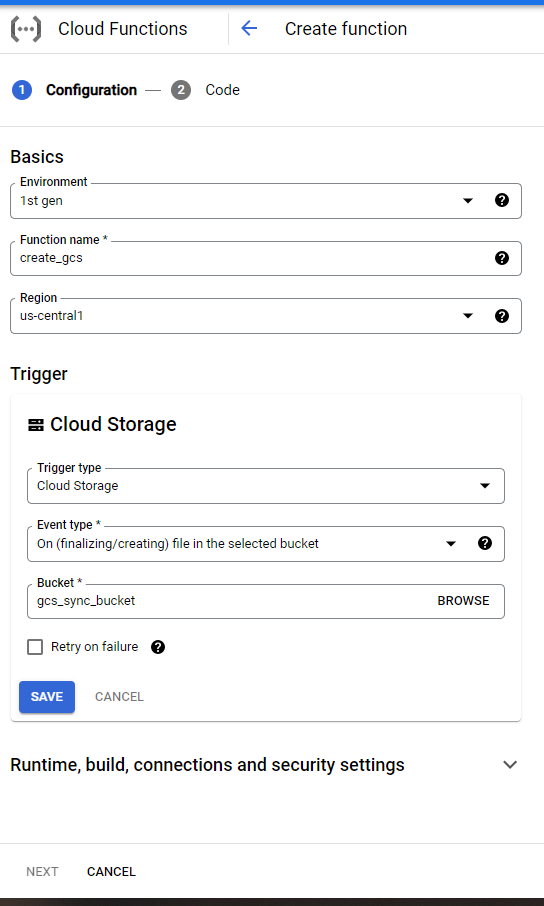
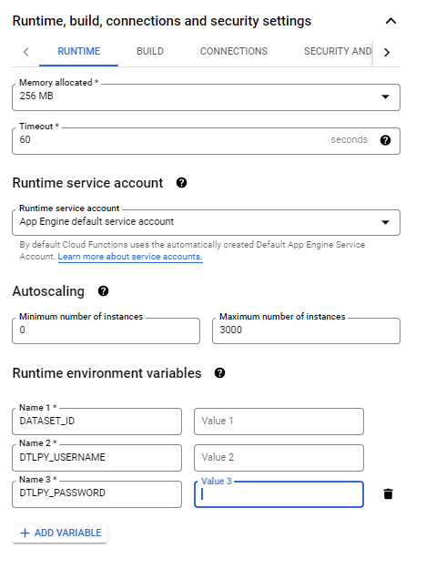

## Dataset Binding with Google Cloud Storage  
  
We will create a GCS cloud function to continuously sync a bucket with Dataloop's Dataset  
  
If you want to catch events from the GCS bucket and update the Dataloop Dataset you need to set up a Cloud function.  
The function will catch the GCS bucket events and will reflect them into the Dataloop Platform.  
  
### Create the cloud function  
1. Create a cloud function for create event (must add the environment variables DATASET_ID, DTLPY_USERNAME and DTLPY_PASSWORD)  
    To populate the values for the vars: `DTLPY_USERNAME`, `DTLPY_PASSWORD` you'll need to create a **DataLoop Bot** on your Dataloop project using the following code:  

```python
import dtlpy as dl
dl.login()
project = dl.projects.get(project_name='project name')
bot = project.bots.create(name='serviceAccount', return_credentials=True)
print('username: ', bot.id)
print('password: ', bot.password)
```
  
  
  
2. runtimes: =>python37, Entry point: create_gcs (your function name)  
3. Add dtlpy to the requirements.txt file  
4. Copy the following code to the main.py file:  

```python
import os
os.environ["DATALOOP_PATH"] = "/tmp"
import dtlpy as dl
dataset_id = os.environ.get('DATASET_ID')
dtlpy_username = os.environ.get('DTLPY_USERNAME')
dtlpy_password = os.environ.get('DTLPY_PASSWORD')
def create_gcs(event, context):
    """Triggered by a change to a Cloud Storage bucket.
    Args:
         event (dict): Event payload.
         context (google.cloud.functions.Context): Metadata for the event.
    """
    file = event
    dl.login_m2m(email=dtlpy_username, password=dtlpy_password)
    dataset = dl.datasets.get(dataset_id=dataset_id,
                              fetch=False  # to avoid GET the dataset each time
                              )
    driver_path = dl.drivers.get(driver_id=dataset.driver).path
    remote_path = None
    if driver_path == '/':
        driver_path = None
    if driver_path is not None and driver_path not in file['name']:
        return
    if driver_path:
        remote_path = file['name'].replace(driver_path, '')
    file_name = 'external://' + file['name']
    dataset.items.upload(local_path=file_name, remote_path=remote_path)
```
4. create another function for delete with delete event with this code and the same settings  

```python
import dtlpy as dl
import os
dataset_id = os.environ.get('DATASET_ID')
dtlpy_username = os.environ.get('DTLPY_USERNAME')
dtlpy_password = os.environ.get('DTLPY_PASSWORD')
def delete_gcs(event, context):
    """Triggered by a change to a Cloud Storage bucket.
    Args:
         event (dict): Event payload.
         context (google.cloud.functions.Context): Metadata for the event.
    """
    file = event
    dl.login_m2m(email=dtlpy_username, password=dtlpy_password)
    dataset = dl.datasets.get(dataset_id=dataset_id,
                              fetch=False  # to avoid GET the dataset each time
                              )
    driver_path = dl.drivers.get(driver_id=dataset.driver).path
    if driver_path == '/':
        driver_path = None
    if driver_path is not None and driver_path not in file['name']:
        return
    if driver_path:
        remote_path = file['name'].replace(driver_path, '')
    else:
        remote_path = file['name']
    dataset.items.delete(filename=remote_path)
```
Deploy and you're good to go!  
